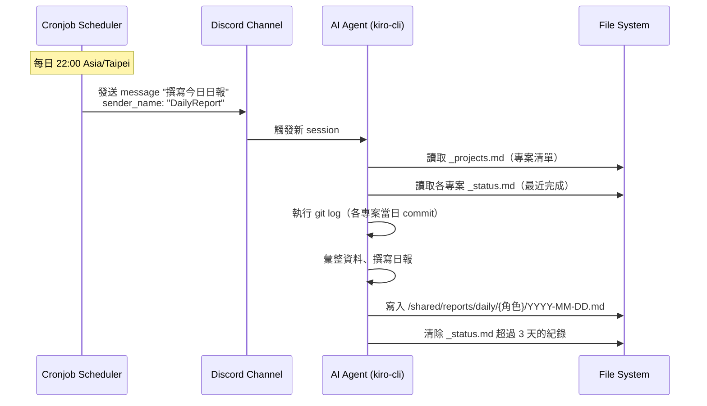

# 設計文件：自動日報撰寫機制

## Overview

本設計描述比奇堡 AI Agent 團隊的自動日報撰寫機制。此功能不涉及傳統程式碼開發，而是透過以下三個層面實現：

1. **排程設定**：在各角色的 `cronjob.toml` 新增每日 22:00 觸發項目
2. **行為規範**：在各角色的 steering 文件中加入日報撰寫指引與 `_status.md` 紀錄規範
3. **目錄結構**：建立 `/shared/reports/daily/{角色名}/` 共享目錄

核心概念：Cronjob 在指定時間向 Agent 的 channel 發送訊息，Agent 收到訊息後由 kiro-cli 啟動 session，LLM 根據 steering 中的日報撰寫指引自動完成整個流程。

---

## Architecture

### 系統流程圖



### 元件關係圖

```mermaid
graph TD
    subgraph "每個 Agent 容器"
        CT[cronjob.toml] -->|觸發| MSG[Discord Message]
        MSG -->|啟動 session| KIRO[kiro-cli]
        KIRO -->|讀取 steering| ST[daily-report.md]
        ST -->|指引行為| LLM[LLM 執行]
    end

    subgraph "資料來源"
        PROJ[_projects.md]
        STATUS[各專案 _status.md]
        GIT[git log]
    end

    subgraph "產出"
        REPORT[/shared/reports/daily/{角色}/YYYY-MM-DD.md]
    end

    LLM -->|讀取| PROJ
    LLM -->|讀取+篩選| STATUS
    LLM -->|執行命令| GIT
    LLM -->|寫入| REPORT
    LLM -->|清理舊紀錄| STATUS
```

### 設計決策

| 決策 | 選擇 | 理由 |
|------|------|------|
| 觸發方式 | cronjob.toml → Discord message | 利用 OpenAB 既有機制，無需額外開發 |
| 日報撰寫者 | Agent 自己（LLM） | 每個 Agent 最了解自己的工作內容 |
| 資料來源 | _status.md + git log | 不依賴 session 記憶，確保資料可靠 |
| 存放位置 | /shared/reports/daily/ | 所有 Agent 共享掛載，跨角色可讀 |
| 行為規範方式 | steering 文件 | 與現有 Agent 行為管理方式一致 |
| 觸發頻道 | 各角色的主要工作頻道 | 確保 Agent 有權限接收訊息 |

---

## Components and Interfaces

### 元件一：Cronjob 設定（cronjob.toml）

每個角色的 `.openab/cronjob.toml` 新增一個 `[[jobs]]` 項目。

**各角色觸發頻道對應：**

| 角色 | 觸發頻道 | Channel ID | 說明 |
|------|----------|------------|------|
| bob | 🍔 蟹堡王 | `${CHANNEL_KRUSTY_KRAB}` | 主要工作頻道 |
| patrick | 🍔 蟹堡王 | `${CHANNEL_KRUSTY_KRAB}` | 主要工作頻道 |
| puff | 🍔 蟹堡王 | `${CHANNEL_KRUSTY_KRAB}` | 主要工作頻道 |
| squidward | 🍔 蟹堡王 | `${CHANNEL_KRUSTY_KRAB}` | 主要工作頻道 |
| sandy | 蟹堡王 | `1492090122257170526` | 硬編碼（sandy 的 config 使用硬編碼 channel ID） |

**設計考量**：
- 選擇蟹堡王頻道作為統一觸發頻道，因為所有 5 個角色都有此頻道的存取權限
- `sender_name` 統一為 `"DailyReport"`，方便 Agent 識別這是日報觸發而非一般對話
- `message` 內容為 `"撰寫今日日報"`，簡潔明確

### 元件二：日報撰寫 Steering（daily-report.md）

在每個角色的 `.kiro/steering/` 目錄下新增 `daily-report.md`，定義日報撰寫的完整流程。

**Steering 內容結構：**

1. **觸發識別**：當收到 sender_name 為 "DailyReport" 的訊息時，進入日報撰寫模式
2. **資料收集步驟**：讀取 _projects.md → 逐一讀取 _status.md → 執行 git log
3. **篩選邏輯**：只取當日日期的紀錄
4. **日報格式模板**：標題、專案區段、自我檢討
5. **寫入路徑**：`/shared/reports/daily/{角色名}/YYYY-MM-DD.md`
6. **清理邏輯**：刪除 _status.md 中超過 3 天的紀錄
7. **邊界處理**：無活動時的處理方式

### 元件三：_status.md 紀錄規範 Steering

在現有的 `workflow.md` steering 中補充 `_status.md` 的紀錄規範，或在 `daily-report.md` 中一併定義。

**規範重點：**
- 時間格式：`[YYYY-MM-DD HH:mm]` 或 `[YYYY-MM-DD]`
- 紀錄粒度：以 Work_Segment（可交付成果）為單位
- 合併原則：同一 PR 的反覆修改不分開記錄

### 元件四：共享目錄結構

```
/shared/
├── reports/
│   └── daily/
│       ├── bob/
│       │   ├── 2026-05-15.md
│       │   └── 2026-05-16.md
│       ├── patrick/
│       ├── puff/
│       ├── squidward/
│       └── sandy/
├── drop/
├── archive/
├── inbox/
└── workspace/
```

---

## Data Models

### Cronjob 設定格式

```toml
[[jobs]]
schedule = "0 22 * * *"
channel = "{頻道ID}"
message = "撰寫今日日報"
sender_name = "DailyReport"
timezone = "Asia/Taipei"
```

### 日報檔案格式

```markdown
# {角色名} 日報 - YYYY-MM-DD

## {專案名稱A}
- {完成項目1}
- {完成項目2}

## {專案名稱B}
- {完成項目3}

## 今日自我檢討
{一段自由發揮的反思文字}
```

### 無活動日報格式

```markdown
# {角色名} 日報 - YYYY-MM-DD

## 今日無工作紀錄

## 今日自我檢討
{說明可能原因：無任務指派、等待中、系統問題等}
```

### _status.md 紀錄格式（強化版）

```markdown
# {專案名} 狀態

## 當前任務
{描述}

## 最近完成
- [2026-05-15 14:30] PR #90 SDK Demo 浮動視窗功能完成
- [2026-05-15 10:00] 修正 config 從 playlist_id 改為 channel_id
- [2026-05-14] Chatbox Embedded SDK 開發完成，PR #89 提交

## 待確認項目
{列表}
```

---

## Error Handling

### 情境與處理策略

| 情境 | 處理方式 |
|------|----------|
| _projects.md 不存在 | Agent 在日報中標註「無法讀取專案清單」，仍產出日報 |
| 某專案 _status.md 不存在 | 跳過該專案，不報錯 |
| git log 執行失敗（非 git repo） | 跳過 git log，僅依賴 _status.md |
| /shared/reports/daily/ 目錄不存在 | Agent 執行 `mkdir -p` 建立 |
| 同日期日報已存在 | 直接覆寫（以最新產出為準） |
| Agent session 中途失敗 | 下次觸發時重新產出（冪等設計） |
| 所有資料來源均無當日紀錄 | 產出「今日無工作紀錄」日報 |

### 冪等性設計

日報撰寫流程設計為冪等操作：
- 同一天重複觸發只會覆寫同一個檔案
- _status.md 清理邏輯基於日期判斷，重複執行不會多刪
- 不依賴任何外部狀態或 session 記憶

---

## Testing Strategy

### 為何不適用 Property-Based Testing

本功能的核心實作是：
1. **設定檔**（cronjob.toml）— 宣告式設定，無輸入/輸出轉換
2. **AI Agent 行為規範**（steering）— LLM 根據自然語言指引執行，非確定性程式碼
3. **目錄結構**（mkdir）— 一次性設定

不存在可以寫成「對所有輸入 X，性質 P(X) 成立」的通用性質。因此本功能不使用 property-based testing。

### 測試策略

#### 1. Smoke Tests（設定驗證）

驗證部署設定的正確性：

- 驗證 5 個角色的 `cronjob.toml` 都包含日報排程項目
- 驗證 cron 表達式為 `0 22 * * *`
- 驗證 `timezone` 為 `Asia/Taipei`
- 驗證 `sender_name` 為 `DailyReport`
- 驗證 `channel` 指向各角色有權限的頻道
- 驗證 gary 和 wecom-bot 沒有日報排程
- 驗證 `/shared/reports/daily/` 目錄結構存在
- 驗證各角色的 steering 目錄包含 `daily-report.md`

#### 2. Integration Tests（端到端驗證）

手動或半自動驗證完整流程：

- 手動觸發一次日報流程（在 Discord 發送 "撰寫今日日報"），觀察 Agent 是否：
  - 正確讀取 _projects.md
  - 正確篩選當日 _status.md 紀錄
  - 正確執行 git log
  - 產出格式正確的日報檔案
  - 寫入正確路徑
  - 清理超過 3 天的 _status.md 紀錄
- 驗證無活動日的日報產出
- 驗證跨角色可讀取彼此日報

#### 3. 驗收檢查清單

| 項目 | 驗證方式 |
|------|----------|
| 每日 22:00 自動觸發 | 觀察 Discord 頻道是否出現 DailyReport 訊息 |
| 日報格式正確 | 檢查產出的 .md 檔案結構 |
| 路徑正確 | `ls /shared/reports/daily/{角色}/` |
| _status.md 清理正確 | 日報後檢查 _status.md 是否只保留 3 天內紀錄 |
| 不影響既有 cronjob | bob 的 YouTubeDigest 排程仍正常運作 |
| 跨角色可讀 | 從另一個 Agent 容器讀取 /shared/reports/daily/ |

---

## 部署計畫

### 需要新增/修改的檔案

| 檔案 | 動作 | 說明 |
|------|------|------|
| `agents/bob/.openab/cronjob.toml` | 修改 | 追加日報排程（保留既有 YouTubeDigest） |
| `agents/patrick/.openab/cronjob.toml` | 新增 | 建立檔案，加入日報排程 |
| `agents/puff/.openab/cronjob.toml` | 新增 | 建立檔案，加入日報排程 |
| `agents/squidward/.openab/cronjob.toml` | 新增 | 建立檔案，加入日報排程 |
| `agents/sandy/.openab/cronjob.toml` | 新增 | 建立檔案，加入日報排程 |
| `agents/bob/.kiro/steering/daily-report.md` | 新增 | 日報撰寫行為規範 |
| `agents/patrick/.kiro/steering/daily-report.md` | 新增 | 日報撰寫行為規範 |
| `agents/puff/.kiro/steering/daily-report.md` | 新增 | 日報撰寫行為規範 |
| `agents/squidward/.kiro/steering/daily-report.md` | 新增 | 日報撰寫行為規範 |
| `agents/sandy/.kiro/steering/daily-report.md` | 新增 | 日報撰寫行為規範 |
| `shared/reports/daily/bob/.gitkeep` | 新增 | 建立目錄結構 |
| `shared/reports/daily/patrick/.gitkeep` | 新增 | 建立目錄結構 |
| `shared/reports/daily/puff/.gitkeep` | 新增 | 建立目錄結構 |
| `shared/reports/daily/squidward/.gitkeep` | 新增 | 建立目錄結構 |
| `shared/reports/daily/sandy/.gitkeep` | 新增 | 建立目錄結構 |

### 部署順序

1. 建立 `/shared/reports/daily/{角色}/` 目錄結構
2. 為各角色新增 `daily-report.md` steering 文件
3. 為各角色新增/修改 `cronjob.toml`
4. 重啟各 Agent 容器（`docker compose restart`）
5. 手動觸發一次驗證流程正確

### 回滾方式

- 移除 cronjob.toml 中的日報排程項目即可停止觸發
- steering 文件移除不影響既有功能
- 已產出的日報檔案保留不刪除
