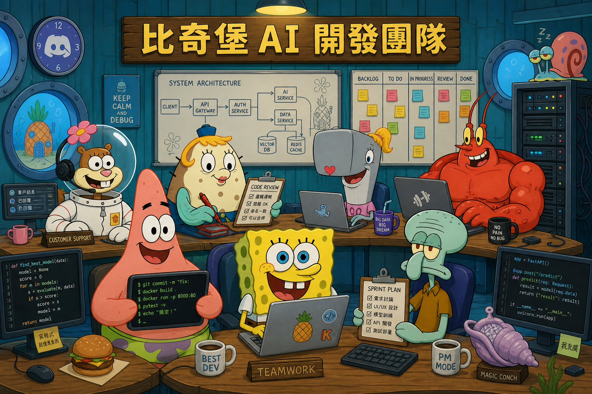
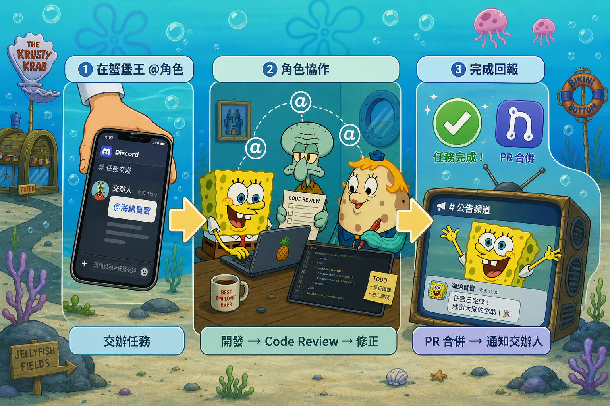
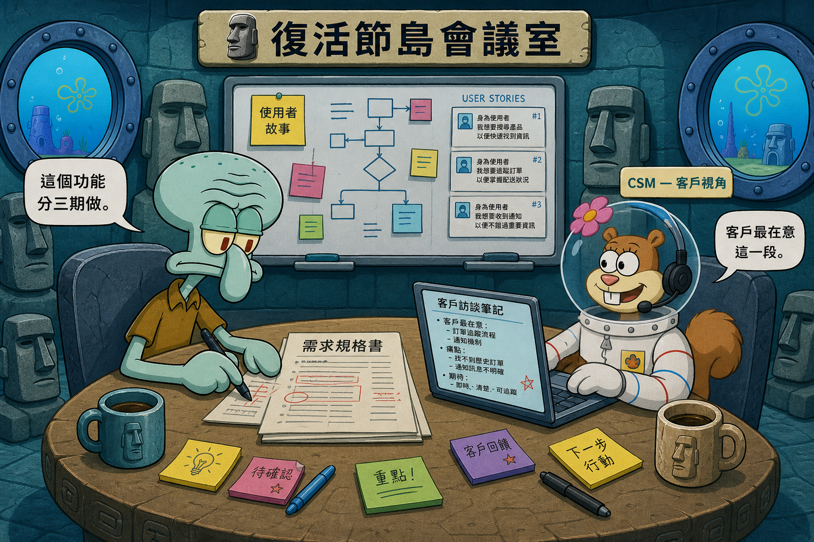

# 🏝️ 比奇堡開發團隊



基於 [OpenAB](https://github.com/openabdev/openab) 的 Discord AI 開發團隊，每個角色都是獨立的 AI agent，擁有自己的個性、職責和工作空間。

## 架構





```
Discord Server: 比奇堡
│
├── AI 角色（OpenAB + kiro-cli）
│   ├── 🧽 海綿寶寶（bob） — 全端工程師
│   ├── ⭐ 派大星（patrick） — 後端工程師
│   ├── 🐋 珍珍（pearl） — 全端工程師
│   ├── 🦞 蝦霸（larry） — 後端工程師
│   ├── 🦑 章魚哥（squidward） — 專案經理 / PM
│   ├── 🐿️ 珊迪（sandy） — 客戶成功經理
│   ├── 🐡 泡芙老師（puff） — Code Review
│   ├── 🐚 神奇海螺（conch） — 團隊神諭者
│   ├── 🐌 小蝸（gary） — 維運助手 / 查詢服務
│
├── 系統服務（僅提供授權，不參與對話）
│   └── 🖥️ 凱倫（karen） — Discord 授權 Token 持有者
│
├── 獨立服務
│   └── 🐌 slash-bot — 小蝸的查詢與容器管理服務（含神奇海螺的容器操作）
│
└── Discord 頻道
    ├── 🍔 蟹堡王 — 工作任務交辦
    ├── 🏖️ 比奇堡廣場 — 人類工程師自由交流
    ├── 🗿 復活節島會議室 — 商業洽談 / 新專案討論
    ├── 🧪 珊迪的實驗室 — 技術研究與實驗
    ├── 🐛 海蟲回報站 — Bug 回報
    └── 📺 鯡魚電視台 — 公告通知
```

## 角色說明

| 角色 | 容器名 | 類型 | 說明 |
|------|--------|------|------|
| 🧽 海綿寶寶 | `bob` | OpenAB agent | 全端工程師，主力開發 |
| ⭐ 派大星 | `patrick` | OpenAB agent | 後端工程師 |
| 🐋 珍珍 | `pearl` | OpenAB agent | 全端工程師 |
| 🦞 蝦霸 | `larry` | OpenAB agent | 後端工程師 |
| 🦑 章魚哥 | `squidward` | OpenAB agent | 專案經理，任務分配與追蹤 |
| 🐿️ 珊迪 | `sandy` | OpenAB agent | 客戶成功經理 |
| 🐡 泡芙老師 | `puff` | OpenAB agent | Code Review |
| 🐚 神奇海螺 | `conch` | OpenAB agent | 團隊神諭者，求助與流程導航 |
| 🐌 小蝸 | `gary` (agent) / `slash-bot` (服務) | OpenAB agent + 獨立服務 | 維運助手，提供 `/usage`、`/activity`、`/status`、`/heal`、`/logs`、`/archive` 指令 |
| 🖥️ 凱倫 | `karen` | 系統服務（非 agent） | 不參與對話，僅持有 Discord Bot Token 供 MCP Server 管理成員/身分組/頻道 |

## 快速開始

```bash
# 1. 複製環境變數範本
cp .env.example .env
# 編輯 .env 填入 token、channel ID、AWS 認證等

# 2. 啟動
docker compose up -d --build

# 3. 各角色登入 kiro-cli
docker exec -it bob kiro-cli login --use-device-flow
docker exec -it patrick kiro-cli login --use-device-flow

# 4. 登入 gh（如需 git 操作）
docker exec -it bob gh auth login

# 5. 重啟
docker compose restart
```

## 目錄結構

```
bikini-bottom/
├── .env.example              ← 環境變數範本
├── .gitignore
├── Dockerfile                ← 基於官方 OpenAB image + git
├── docker-compose.yml
├── agents/                   ← AI 角色
│   ├── bob/                  ← 🧽 海綿寶寶（全端工程師）
│   ├── patrick/              ← ⭐ 派大星（後端工程師）
│   ├── pearl/                ← 🐋 珍珍（全端工程師）
│   ├── larry/                ← 🦞 蝦霸（後端工程師）
│   ├── squidward/            ← 🦑 章魚哥（PM）
│   ├── sandy/                ← 🐿️ 珊迪（客戶成功經理）
│   ├── puff/                 ← 🐡 泡芙老師（Code Review）
│   ├── conch/                ← 🐚 神奇海螺（團隊神諭者）
│   ├── gary/                 ← 🐌 小蝸（維運助手，也是 slash-bot 的人格）
│   └── karen/               ← 🖥️ 凱倫（系統服務，僅持有授權 Token）
├── shared/                   ← Bot 間共享檔案交換區
│   └── drop/                 ← 扁平交換區（每日自動清空）
├── services/                 ← 獨立服務
│   └── slash-bot/            ← 🐌 小蝸（查詢 + 容器管理 + 海螺容器操作）
└── docs/
    ├── usage-guide.md        ← 使用指南（給交辦人看）
    ├── new-agent-sop.md      ← 新增角色 SOP
    ├── git-flow-sop.md       ← Git Flow 規範
    ├── discord-channels.md   ← Discord 頻道配置
    └── bot-setup-sop.md      ← Bot 建立 SOP
```

## 共用 Skills

所有角色共享的 skill 放在 `shared/skills/`，透過 `AGENT_SKILLS` 環境變數控制掛載。Skill 為按需載入，不會每次對話都佔用 context。

| Skill | 用途 | 來源 |
|-------|------|------|
| `xlsx` | 產生 Excel 試算表 | 本地 |
| `pdf` | 產生 PDF 文件 | 本地 |
| `pptx` | 產生 PowerPoint 簡報 | 本地 |
| `docx` | 產生 Word 文件 | 本地 |
| `doc-coauthoring` | 企業微信文檔協作 | 本地 |
| `company-kb` | 科定企業公司知識庫 | [KedingTW/agent-skills](https://github.com/KedingTW/agent-skills) |

### 外部 Skill 同步

來自外部 repo 的 skill 透過 `scripts/sync-skills.sh` 同步，來源定義在 `shared/skills/skills.json`。

```bash
# 同步所有外部 skill（在 WSL 執行）
bash scripts/sync-skills.sh

# 同步完後重啟容器生效
docker compose restart
```

新增外部 skill 步驟：
1. 在 `shared/skills/skills.json` 的 `sources` 加一筆
2. 在 docker-compose 各角色的 `AGENT_SKILLS` 加上 skill 名稱
3. 執行 `bash scripts/sync-skills.sh`
4. 重啟容器

## 常用指令

```bash
# 啟動全部
docker compose up -d --build

# 看特定角色 logs
docker compose logs -f bob

# 重啟特定角色
docker compose restart bob

# 更新 OpenAB 到最新版
docker compose build --pull
docker compose up -d
```

## 文件導讀

| 文件 | 對象 | 內容 |
|------|------|------|
| [docs/usage-guide.md](docs/usage-guide.md) | 交辦人（非工程師） | 怎麼跟 AI 角色互動、流程圖、指令說明（含神奇海螺監控指令） |
| [docs/new-agent-sop.md](docs/new-agent-sop.md) | 維運人員 | 新增 AI 角色的步驟 |
| [docs/bot-setup-sop.md](docs/bot-setup-sop.md) | 維運人員 | Discord Bot 建立與設定 |
| [docs/git-flow-sop.md](docs/git-flow-sop.md) | 開發者 | Git 分支與 PR 規範 |
| [docs/discord-channels.md](docs/discord-channels.md) | 所有人 | Discord 頻道用途說明 |
| [docs/k3s-operations-guide.md](docs/k3s-operations-guide.md) | 維運人員 | K3s 維運指南（含插畫） |
| [docs/k3s-migration-plan.md](docs/k3s-migration-plan.md) | 維運人員 | K3s 遷移規劃 |

## 新增角色

參考 [docs/new-agent-sop.md](docs/new-agent-sop.md)。

## 授權

MIT
